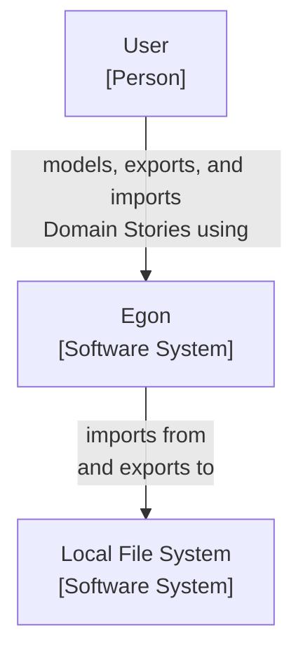

# TODO
- 1 model = 1 Domain Story = 1 File

# Introduction and Goals {#section-introduction-and-goals}

*Describes the relevant requirements and the driving forces that software architects and development team must consider.*

## Requirements Overview {#_requirements_overview}

Egon is a modeling tool that implements the notation and syntactical rules of [Domain Storytelling](https://domainstorytelling.org/). It supports its users when modeling in workshops and sharing workshop results.

## Stakeholders {#_stakeholders}

- Users: Intended users are are already familiar with Domain Storytelling. They do not require a technical background.
- Developers: Egon was initiated and developed by German software company *WPS - Workplace Solutions GmbH*. All active  developers are employees of this company. Most developers are also users of Egon.
- Contributors: Programmers from all around the world can contribute code to Egon via pull requests. We assume that contributors are also users of Egon.

## Quality Goals {#_quality_goals}

Top quality goals are:
- Functional suitability: System provides functions that meets stated or implied needs.
- Operability: System can be understood, learned, used, and is attractive to its users.

# Architecture Constraints {#section-architecture-constraints}

*Any requirement that constrains software architects in their freedom of design and implementation decisions or decision about the development process.*

| Constraint                | Reason                                              |
|---------------------------|-----------------------------------------------------|
| runs in browser           | users do not need to install anything on their machine; deploy new versions easily |
| distributed under liberal open source license | increases adoption by providing Egon free of charge (even for "commercial" use), without risk of vendor lock-in; while Egon is open source, the domain stories created with Egon do *not* fall under an open source license |
| no registration or log-in required | increases adoption; ease of use; avoids security problems; lowers maintenance effort |
| no centralized storage | avoids security problems; lowers maintenance effort |
| can by hosted locally or within company network | avoids vendor lock-in; increases adoption by companies |
| when run locally: can be used without internet connection  | increases robustness       |

# System Scope and Context {#section-system-scope-and-context}

*System scope and context delimits the system from all its communication partners. It thereby specifies the external interfaces.*

The following C4 System Context Diagram shows Egon.io as black box with its communication partners (neighboring systems and users). 

  
# Solution Strategy {#section-solution-strategy}

*A short summary and explanation of the fundamental decisions and solution strategies, that shape the system’s architecture.*

## Decision: Using a Modeling Framework

Domain Storytelling is a modeling language and we wanted to build a proper modeling tool that implements the notation and grammar. We assumed that it was easier to use a modeling framework rather than building this from scratch or using a diagramming library that only knows about boxes and arrows. Hence, we searched for a modeling framework that...

- was flexible enough to support the Domain Storytelling modeling language 
- and fulfilled the [architectural constraints](#section-architecture-constraints).

## Decision: Using bpmn-js as Modeling Framework

[bpmn-js](https://github.com/bpmn-io/bpmn-js) checked all the boxes. It is a JavaScript modeling library for the BPMN language. For version 1.x.x. of Egon, we replaced BPMN with the Domain Storytelling modeling language and stayed technologically rather close to bpmn-js: JavaScript as programming language, tools for building and testing, etc.

However, the decision for using bpmns-js came with a disadvantages: For some features, Egon developers had to dive deep into the inner workings of bpmn-js and change the frameworks behaviour or needed to finkd workarounds. At the same time, bpmn-js offer a lot of features that are not relevant for Domain Storytelling.

> The decision for using bpmn-js was revisited several times, but until now, we are not aware of an alternative modeling framework that would be a better fit.

## Decision: Better Separation Between Egon and bpmn-js

After a few years of development, we had developed a number of features that had little to no connection to the bpmn-js framework. However, the architecture made it difficult to distinguish...
- code that deals with core modeling activities and requires knowledge of bpmn-js
- and code that is rather independent of bpmn-js

We wanted to flatten the learning curve for new developers by better separating Egon and bpmn-js. This went hand in hand with migration to a different tech stack (Typescript and Angular, see below) that helped us to better express the intended architecture.

## Decision: Migrate to Typescript and Angular

TODO...

The result of this migration is Egon v2.0.0

## Decision: Use Browser Storage to Persist Configuration

TODO

## Decision: No Mobile Support

TODO

# Building Block View {#section-building-block-view}

*The building block view shows the static decomposition of the system into building blocks (modules, components, subsystems, classes, interfaces, packages, libraries, frameworks, layers, partitions, tiers, functions, macros, operations, data structures, …) as well as their dependencies (relationships, associations, …).*

## Whitebox Overall System {#_whitebox_overall_system}

TODO
