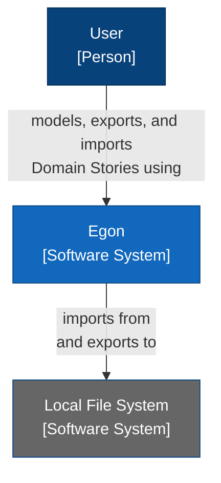
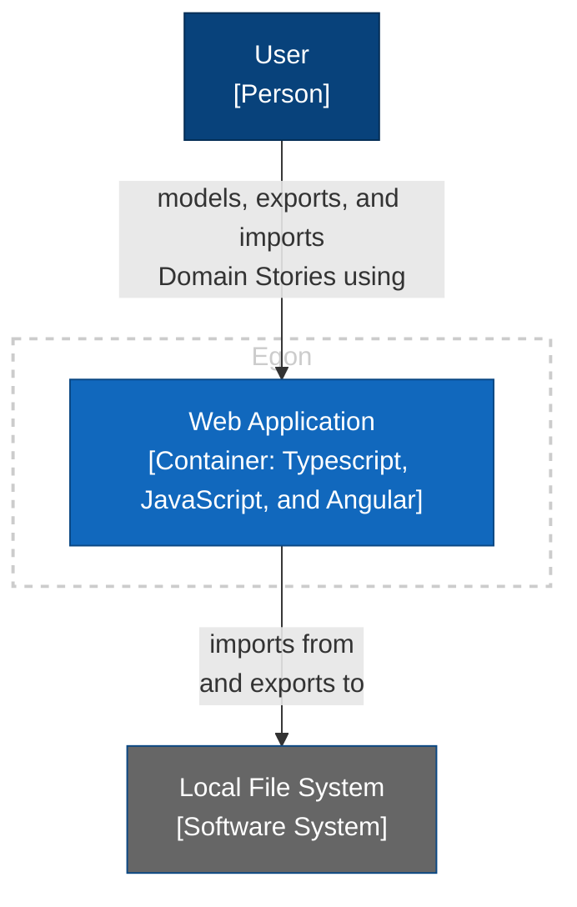
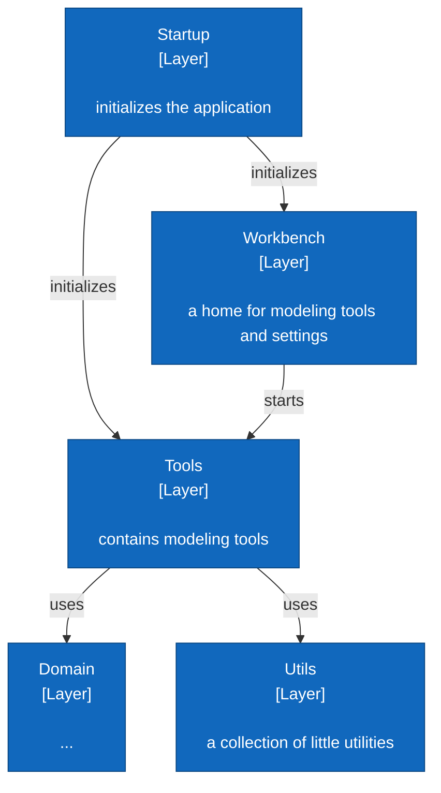
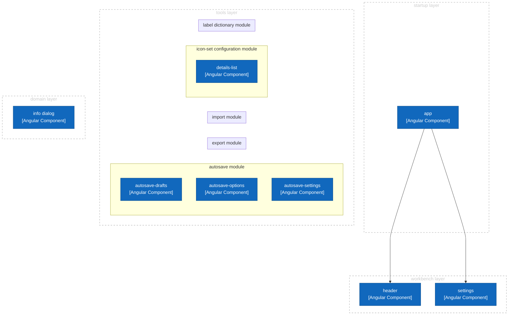
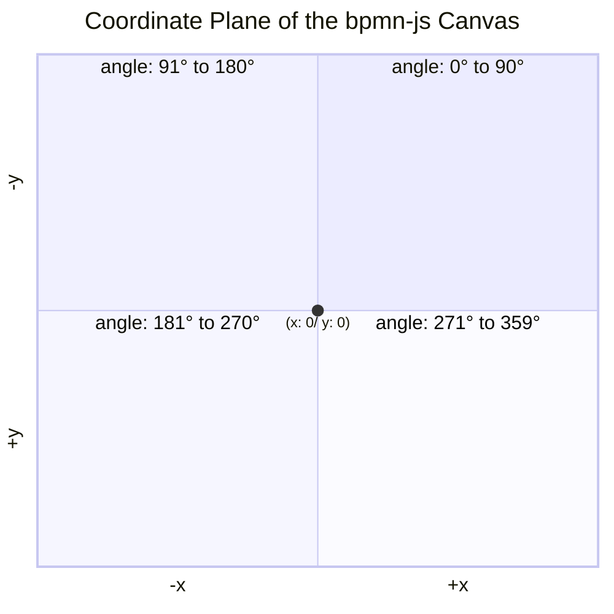

# Introduction and Goals {#section-introduction-and-goals}

*Describes the relevant requirements and the driving forces that software architects and development team must consider.*

## Requirements Overview {#_requirements_overview}

Egon is a modeling tool that implements the notation and syntactical rules of [Domain Storytelling](https://domainstorytelling.org/). It supports its users when modeling in workshops and sharing workshop results.

## Stakeholders {#_stakeholders}

- Users: Intended users are are already familiar with Domain Storytelling. They do not require a technical background.
- Developers: Egon was initiated and developed by German software company *WPS - Workplace Solutions GmbH*. All active developers are employees of this company. Most developers are also users of Egon.
- Contributors: Programmers from all around the world can contribute code to Egon via pull requests. We assume that contributors are also users of Egon.

## Quality Goals {#_quality_goals}

Top quality goals are:
- Functional suitability: System provides functions that meets stated or implied needs.
- Operability: System can be understood, learned, used, and is attractive to its users.

# Architecture Constraints {#section-architecture-constraints}

*Any requirement that constrains software architects in their freedom of design and implementation decisions or decision about the development process.*

| Constraint                | Reason                                              |
|---------------------------|-----------------------------------------------------|
| runs in browser           | users do not need to install anything on their machine; deploy new versions easily |
| distributed under liberal open source license | increases adoption by providing Egon free of charge (even for "commercial" use), without risk of vendor lock-in; while Egon is open source, the domain stories created with Egon do *not* fall under an open source license |
| no registration or log-in required | increases adoption; ease of use; avoids security problems; lowers maintenance effort |
| no centralized storage | avoids security problems; lowers maintenance effort |
| can by hosted locally or within company network | avoids vendor lock-in; increases adoption by companies |
| when run locally: can be used without internet connection  | increases robustness       |

# System Scope and Context {#section-system-scope-and-context}

*System scope and context delimits the system from all its communication partners. It thereby specifies the external interfaces.*

The following C4 System Context Diagram shows Egon.io as black box with its communication partners (neighboring systems and users). 

  
# Solution Strategy {#section-solution-strategy}

*A short summary and explanation of the fundamental decisions and solution strategies, that shape the system’s architecture.*

## Decision: Using a Modeling Framework

Domain Storytelling is a modeling language and we wanted to build a proper modeling tool that implements the notation and grammar. We assumed that it was easier to use a modeling framework rather than building this from scratch or using a diagramming library that only knows about boxes and arrows. Hence, we searched for a modeling framework that...

- was flexible enough to support the Domain Storytelling modeling language 
- and fulfilled the [architectural constraints](#section-architecture-constraints).

## Decision: Using bpmn-js as Modeling Framework

[bpmn-js](https://github.com/bpmn-io/bpmn-js) checked all the boxes. It is a JavaScript modeling library for the BPMN language. For version 1.x.x. of Egon, we replaced BPMN with the Domain Storytelling modeling language and stayed technologically rather close to bpmn-js: JavaScript as programming language, tools for building and testing, etc.

However, the decision for using bpmn-js had tradeoffs: For some features, Egon developers had to dive deep into the inner workings of bpmn-js and change the frameworks behavior or needed to find workarounds. At the same time, bpmn-js offer a lot of features that are not relevant for Domain Storytelling.

> The decision for using bpmn-js was revisited several times, but until now, we are not aware of an alternative modeling framework.

## Decision: Separation Between Egon and bpmn-js

After a few years of development, we had developed a number of features that had little to no connection to the bpmn-js framework. However, the architecture made it difficult to distinguish...
- code that deals with core modeling activities and requires knowledge of bpmn-js
- and code that is rather independent of bpmn-js

We wanted to flatten the learning curve for new developers by better separating Egon and bpmn-js. This went hand in hand with migration to a different tech stack (Typescript and Angular, see below) that helped us to better express the intended architecture.

## Decision: Migrate to Typescript and Angular

Since all developers share a common background (see [Stakeholders](#_stakeholders)) which includes experience with Typescript and Angular, we decided to migrate most of our code to this tech stack. This lowered the learning curve for new developers, enabling them to work on new features without detailed knowledge of bpmn-js.

The result of this migration is Egon v2.x.x

## Decision: No Touch Support, no Multi-User Support

Users of Egon facilitate Domain Storytelling workshops by modeling the participant's domain stories. They are supposed to share their screen with the participants so that everyone can see how the domain story evolves. In this setting, collaborative editing by multiple users is not relevant. 

We assume that a users prefer to model with devices that have a keyboard and mouse/touch pad rather than on touch devices. Hence, touch support was not a requirement when selecting the framework.

# Building Block View {#section-building-block-view}

*The building block view shows the static decomposition of the system into building blocks (modules, components, subsystems, classes, interfaces, packages, libraries, frameworks, layers, partitions, tiers, functions, macros, operations, data structures, …) as well as their dependencies (relationships, associations, …).*

## Level 1: Overall System

Since there is no backend and only one frontend application, the overall architecture is very simple – it consists of just one building block (in C4: *container*). Here it is depicted as C4 container diagram:

## Level 2: Web Application

On the top level, the web app is organized into a layered architecture. Some layers contain – among other things –  Angular modules and components which themselves are structured into technical layers.

### Layers

The folder structure resembles the layered architecture:

- `app` => Startup layer
  - `workbench` => Workbench layer
  - `tools` => Tools layer
  - `domain` => Domain layer
  - `utils` => Utils layer

The architecture rules are enforced with ArchLint and can be checked by running `npm run archlint.`

### Angular Modules and Components

All arrows represent dependencies.

TODO: complete diagram

### Technical Layering of Angular Components

## Level 3: Tools

TODO: Show vertical slices and usage of bmpn-js. The folder structure resembles the vertical slices. 

## bpmn-js

This section is based on the [bpmn-js documentation](https://bpmn.io/toolkit/bpmn-js/walkthrough/) and aims at giving a brief introduction to the library. This should be helpful when working on the `modeler` tool.

bpmn-js is built on top of diagram-js and bpmn-moddle. bpmn-js ties both together and provides the *palette* and the *context pad*. 

The *canvas* contains graphical *elements* of different *types* (*shape*, *label*, *connection*, possibly more). Thereby it ties both the BPMN elements and the graphical elements together. The graphical elements can contains *business objects* that carry the information that is specific to the modeling language. Business object have types too – e.g., `bpmn:ExclusiveGateway` (for the BPMN modeling language ) or `domainStory:workObject` (for the Domain Storytelling modeling language). Domain Storytelling's element types for business objects are defined in`elementTypes.ts`.

Element positions on the canvas work as shown in this diagram:

# Runtime View {#section-runtime-view}

*The runtime view describes concrete behavior and interactions of the system’s building blocks in form of scenarios.*

This section is omitted as Egon consists only of one building block.

# Deployment View {#section-deployment-view}

*The deployment view describes the technical infrastructure used to execute your system.*

TODO: Maybe document development pipeline here (Github Action builds and pushes to Github Pages, builds Docker container)

# Architecture Decisions {#section-design-decisions}

*Important, expensive, large scale or risky architecture decisions including rationales. With “decisions” we mean selecting one alternative based on given criteria.*

## Decision: Use Web Storage to Persist User-specific Information

Users can configure their icon set and autosave properties. To avoid having to configure everything again the next time a user uses Egon, the user-specific information must be persisted. 

Also, autosave creates drafts that must be restorable across browser sessions to recover Domain Stories after a browser crash.

Since Egon runs completely in the browser, we must use local means to persist all user-specific information. 

**Decision:** Use *Web Storage* (i.e., `localStorage`) to persist user-specific information across browser sessions. All popular web browsers implement this standard. 

Alternatively, cookies could be used (and in fact were used in earlier Egon versions). Unlike cookies, the storage limit is far larger (at least 5MB).

## TODO
- 1 model = 1 Domain Story = 1 File
- files are self-contained: they include the icon set (including custom icons); makes it easier to share domain stories with users
- Angular-specific patterns

# Quality Requirements {#section-quality-scenarios}

*This section contains all quality requirements as quality tree with scenarios.*

TBD

# Risks and Technical Debts {#section-technical-risks}

*A list of identified technical risks or technical debts, ordered by priority*

TBD

# Glossary

Egon uses terminology of Domain Storytelling in the UI and in the code. See [Domain Storytelling Website](https://domainstorytelling.org/quick-start-guide#the-pictographic-language).
