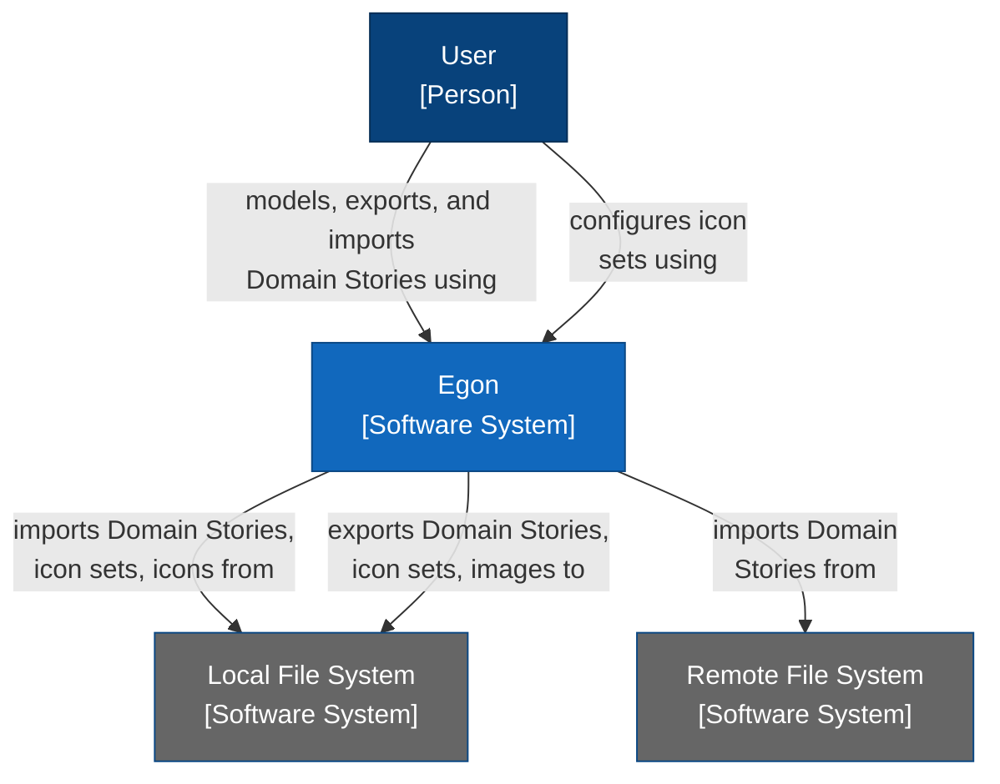
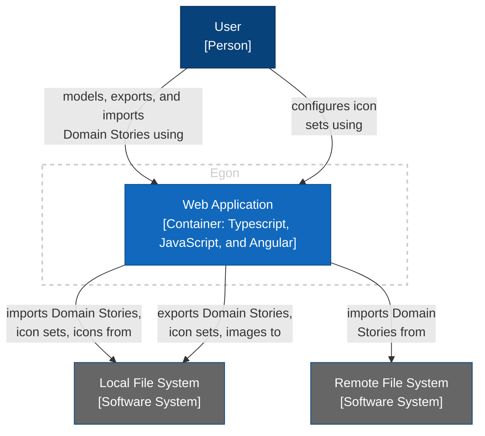
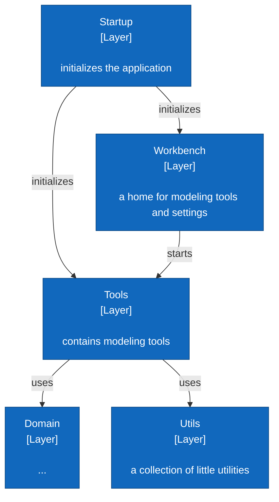
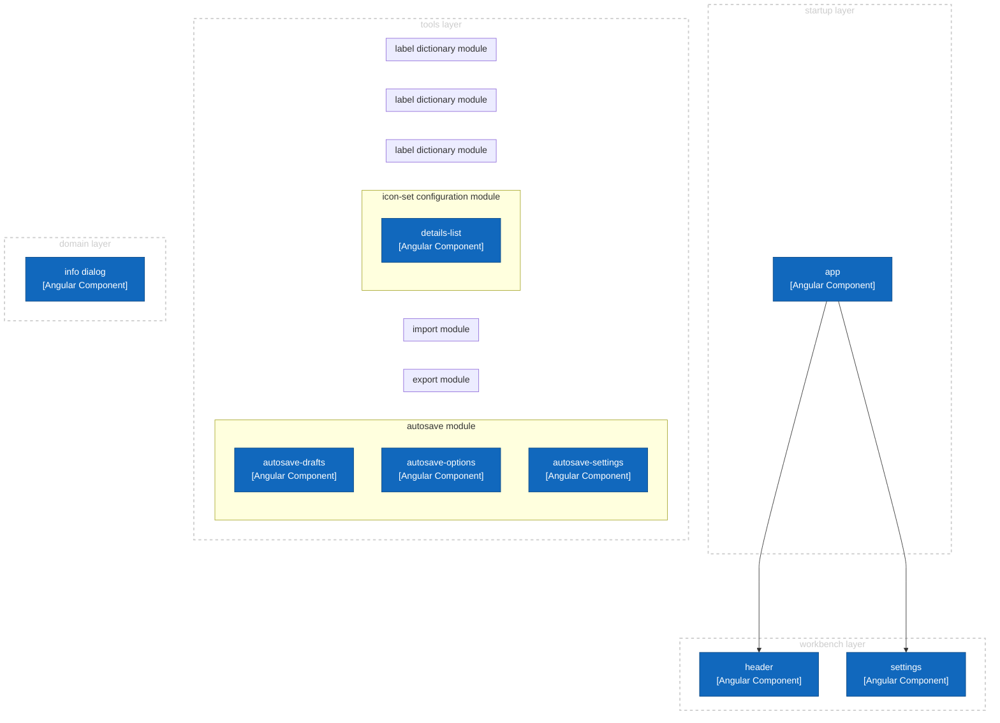
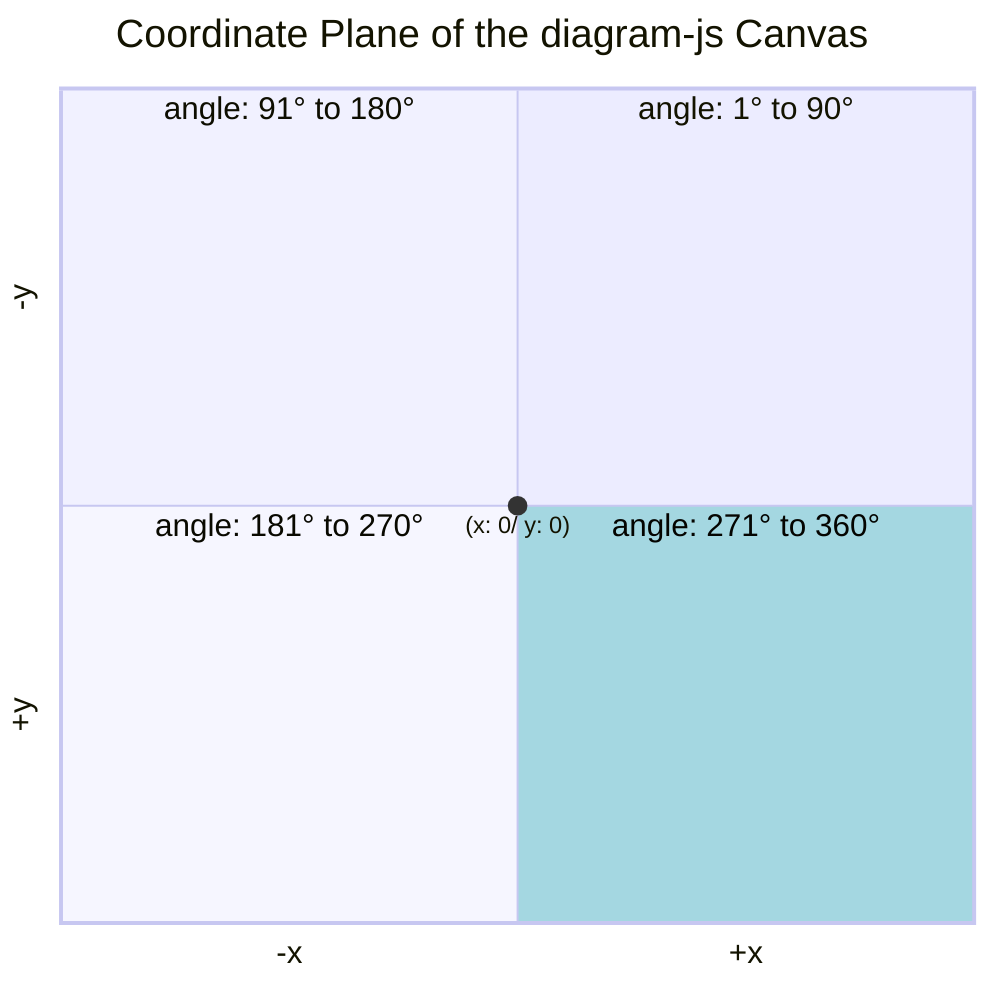

# Introduction and Goals

*Describes the relevant requirements and the driving forces that software architects and development team must consider.*

## Requirements Overview {#_requirements_overview}

Egon is a modeling tool that implements the notation and syntactical rules of [Domain Storytelling](https://domainstorytelling.org/). It supports its users when modeling in workshops and sharing workshop results.

## Stakeholders {#_stakeholders}

- Users: Intended users are are already familiar with Domain Storytelling. They do not require a technical background.
- Developers: Egon was initiated and developed by German software company *WPS - Workplace Solutions GmbH*. All active developers are employees of this company. Most developers are also users of Egon.
- Contributors: Programmers from all around the world can contribute code to Egon via pull requests. We assume that contributors are also users of Egon.

## Quality Goals {#_quality_goals}

Top quality goals are:
- Functional suitability: System provides functions that meets stated or implied needs.
- Operability: System can be understood, learned, used, and is attractive to its [users](#introduction-and-goals).

# Architecture Constraints {#section-architecture-constraints}

*Any requirement that constrains software architects in their freedom of design and implementation decisions or decision about the development process.*

| Constraint                | Reason                                              |
|---------------------------|-----------------------------------------------------|
| runs in browser           | users do not need to install anything on their machine; developers can deploy new versions easily |
| distributed under liberal open source license | increases adoption by providing Egon free of charge (even for "commercial" use), without risk of vendor lock-in; while Egon is open source, the domain stories created with Egon do *not* fall under an open source license |
| no registration or log-in required | increases adoption; ease of use; avoids security problems; lowers maintenance effort |
| no centralized storage | avoids security problems; lowers maintenance effort |
| can be hosted locally or within company network | avoids vendor lock-in; increases adoption by companies |
| when run locally: can be used without internet connection  | increases robustness       |

# System Scope and Context {#section-system-scope-and-context}

*System scope and context delimits the system from all its communication partners. It thereby specifies the external interfaces.*

The following C4 System Context Diagram shows Egon.io as black box with its communication partners (neighboring systems and users). 

  
# Solution Strategy {#section-solution-strategy}

*A short summary and explanation of the fundamental decisions and solution strategies, that shape the system’s architecture.*

## Decision: Using a Modeling Framework

Domain Storytelling is a modeling language and we wanted to build a proper modeling tool that implements the notation and grammar. We assumed that it was easier to use a modeling framework rather than building this from scratch or using a diagramming library that only knows about boxes and arrows. Hence, we searched for a modeling framework that...

- was flexible enough to support the Domain Storytelling modeling language 
- and fulfilled the [architectural constraints](#section-architecture-constraints).

[diagram-js](https://github.com/bpmn-io/diagram-js) checked all the boxes. It is a JavaScript modeling library, originally developed for the [bpmn-js BPMN editor](https://github.com/bpmn-io/bpmn-js) but now language-agnostic. 

Older versions of Egon (v1 and v2) depended on bpmn-js which had tradeoffs: For some features, Egon developers had to dive deep into the inner workings of bpmn-js and work around the framework's behavior. At the same time, bpmn-js offers a lot of features that are not relevant for Domain Storytelling. Egon v3 marked the shift from using bpmn-js to diagram-js as our modeling framework.

## Decision: Separation Between Egon and diagram-js

Many of Egon's features do not depend on the diagram-js framework. The architecture should reflect that by clearly distinguishing between
- code that deals with core modeling activities and requires knowledge of diagram-js
- and code that is independent of diagram-js

This separation flattens the learning curve for new developers. 

## Decision: Typescript and Angular

Since all developers share a common background (see [Stakeholders](#_stakeholders)) which includes experience with Typescript and Angular, this tech stack has been used since Egon v2. It also enabled us to  express this intended architecture.

## Decision: No Touch Support, no Multi-User Support

Users of Egon facilitate Domain Storytelling workshops by modeling the participant's domain stories. They are supposed to share their screen with the participants so that everyone can see how the domain story evolves. In this setting, collaborative editing by multiple users is not relevant. 

We assume that a users prefer to model with devices that have a keyboard and mouse/touch pad rather than on touch devices. Hence, touch support was not a requirement when selecting the framework.

# Building Block View {#section-building-block-view}

*The building block view shows the static decomposition of the system into building blocks (modules, components, subsystems, classes, interfaces, packages, libraries, frameworks, layers, partitions, tiers, functions, macros, operations, data structures, …) as well as their dependencies (relationships, associations, …).*

## Level 1: Overall System

Since there is no backend and only one frontend application, the overall architecture is very simple – it consists of just one building block (in C4: *container*). Here it is depicted as C4 container diagram:

## Level 2: Web Application

On the top level, the web app is organized into a layered architecture. Some layers contain – among other things –  Angular modules and components which themselves are structured into technical layers.

### Layers

The folder structure resembles the layered architecture:

- `app` => Startup layer
  - `workbench` => Workbench layer
  - `tools` => Tools layer
  - `domain` => Domain layer
  - `utils` => Utils layer

The architecture rules are enforced with ArchLint and can be checked by running `npm run archlint.`

### Angular Modules

All arrows represent dependencies.

TODO: complete diagram

### Technical Layering within Angular Components

## Level 3: Tools

TODO: Show vertical slices and usage of diagram-js. The folder structure resembles the vertical slices. 

## diagram-js

Unfortunately, diagram-js comes with little documentation. We recommend reading the "Diagram Interaction / Modeling (diagram-js)" section in the [bpmn-js documentation](https://bpmn.io/toolkit/bpmn-js/walkthrough/). In short, diagram-js renders diagrams and offers extensible infrastructure (plug-in system, event bus, command stack, and service loop). It handles user interaction (move, connect, hover, select, add, remove) and provides the *canvas*, *palette*, and *context pad*. 

Some more useful information for working on the `modeler` tool:

The *canvas* contains graphical *elements* of different *types* (of which Egon only uses the ones mentioned in the table below). The graphical elements can contain *business objects* that carry the information that is specific to the modeling language. Business object have types too – e.g., `domainStory:workObject` (for the Domain Storytelling modeling language). Domain Storytelling's element types for business objects are defined in `elementTypes.ts`.

| Domain Story Element Types | represented as diagram-js type |
|----------------------------|--------------------------------|
| Actor | shape |
| Work Object | shape |
| Group | shape |
| Textannotation | shape |
| Activity | connection |
| Connection* | connection |

*) This refers to the dashed line that connects annotations with actors, work objects, or groups.

Element positions on the canvas work as shown in this diagram:

Per default, the visible area of the canvas is the bottom right quadrant (+x/+y). That means that 0/0 is in the top left corner of the screen. 

# Runtime View {#section-runtime-view}

*The runtime view describes concrete behavior and interactions of the system’s building blocks in form of scenarios.*

This section is omitted as Egon consists only of one building block.

# Deployment View {#section-deployment-view}

*The deployment view describes the technical infrastructure used to execute your system.*

TODO: Maybe document development pipeline here (Github Action builds and pushes to Github Pages, builds Docker container)

# Architecture Decisions {#section-design-decisions}

*Important, expensive, large scale or risky architecture decisions including rationales. With “decisions” we mean selecting one alternative based on given criteria.*

## Decision: Use Web Storage to Persist User-specific Information

Users can configure their icon set and autosave properties. To avoid having to configure everything again the next time a user uses Egon, the user-specific information must be persisted. 

Also, autosave creates drafts that must be restorable across browser sessions to recover Domain Stories after a browser crash.

Since Egon runs completely in the browser, we must use local means to persist all user-specific information. 

**Decision:** Use *Web Storage* (i.e., `localStorage`) to persist user-specific information across browser sessions. All popular web browsers implement this standard. 

Alternatively, cookies could be used (and in fact were used in earlier Egon versions). Unlike cookies, the storage limit is far larger (at least 5MB).

## Decision: 1 Domain Story = 1 Self-contained File

Since Egon does not use centralized storage (see [architectural constraints](#section-architecture-constraints)), users need to export their Domain Stories to their local file system as files. 

The most simple way of doing that is to put one domain story into one file and make it self-contained, i.E. include the SVG of the icon set (including custom icons). This makes it easy to share domain stories with other users.

Alternatively a one-to-many relationship (one file containing several Domain Stories) would enable references between Domain Stories. However, this would likely make it necessary to build more features for the export and import tools (e.g., export all stories or just specific ones).

**Decision:** We choose simplicity over advanced functionality and persist each domain story as one self-contained file.

## TODO: More decisions
- JSON as file format
- no separation of model and diagram
- Angular-specific patterns

# Quality Requirements {#section-quality-scenarios}

*This section contains all quality requirements as quality tree with scenarios.*

TBD

# Risks and Technical Debts {#section-technical-risks}

*A list of identified technical risks or technical debts, ordered by priority*

TBD

# Glossary

Egon uses terminology of Domain Storytelling in the UI and in the code. See [Domain Storytelling Website](https://domainstorytelling.org/quick-start-guide#the-pictographic-language).
