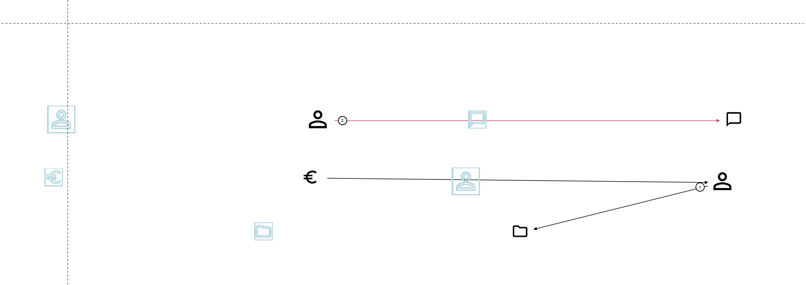

# Current bugs after BPMN.js --> Diagram.js

- copyPaste does not work
- lasso tool displays a grey line right of the selected frame (it's an empty multi element context pad)
- alignment lines are not visible
- shortcuts that don't work: ctrl + A, H, L, S, E

### Changed but might be better or not worth fixing

- lasso tool displays a frame around all selected elements
- when selected by lasso tool, hovering over an element does not change the outline to egon blue
- connect with activity dashed line is blue until you hover over an allowed target

### bugs also contained in applatest

- when creating bendpoints on a colored activity, during creation the activity is displayed as black
- space tool works but sometimes the preview gets stuck

- no snapping to shape middle when connecting
